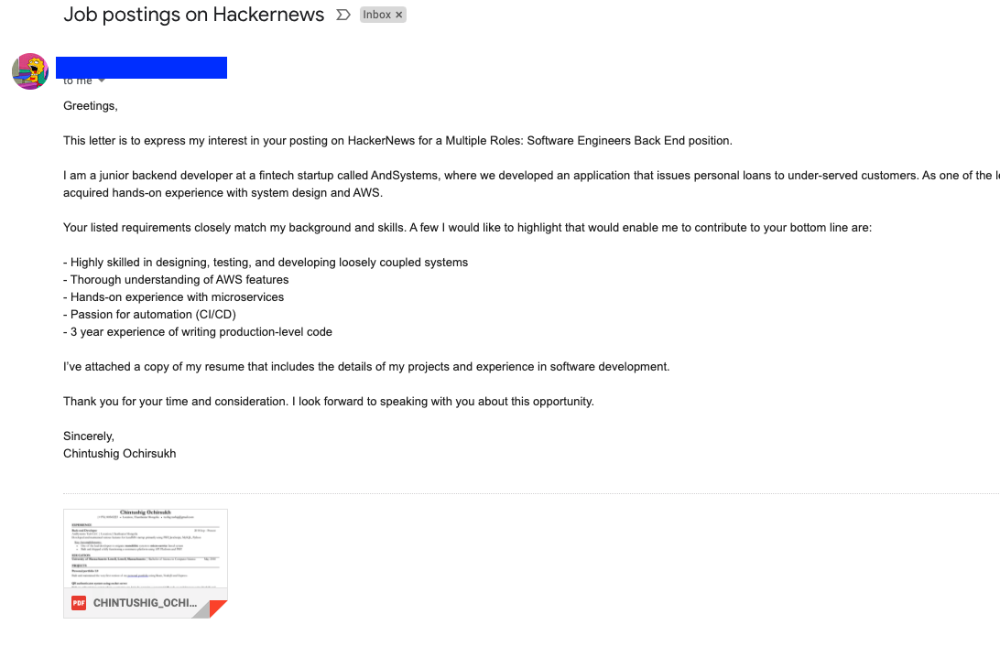

## Basic overview
This project is the first phase of my hackernews crawler.
The main purpose of this project is to automate the mundane task of browsing through hackernews job postings, and applying one by one.

&nbsp;&nbsp;&nbsp;&nbsp;&nbsp;&nbsp;&nbsp;&nbsp;&nbsp;&nbsp;&nbsp;&nbsp;&nbsp;&nbsp;&nbsp;&nbsp;&nbsp;&nbsp;&nbsp;


[](https://opensource.org/licenses/MIT)

## Installation

```bash
git clone this-project
```

```python
pip3 install scrapy
```

## Usage
Firstly, we crawl the data from hackernews and extract the ones that are related to me.
#### Running the crawler
```python
scrapy runspider crawler.py -o ../data/output.json
```
Secondly, we clean the data and add weight to fields that corresponds more to my skillset.
#### Running the cleaning script
```python
python3 main.py
```
#### How to get an app password
In order to send an email from your email account, you need to acquire your app password from your google account.
1. Go to manage my google account
2. Under "Signing in to Google" confirm that "2-Step Verification" is "On" for the account.
3. Also under "Signing in to Google" Select "App passwords".
4. Select the app as "Mail" and the device as "Other (Custom name)" and name it.
5. Copy the app password, it will be in a yellow box and looks like: "XXXX XXXX XXXX XXXX"
6. Copy app password and email into email-credentials.json
```bash
cp email-credentials.json.dist email-credentials.json
```
#### Running the mailing service
Lastly, we send our application with the attached resume to the extracted emails from the data if the job posting includes any email.

```python
python3 applier.py
```

#### Result




## Contributing

1. Fork it
2. Create your feature branch (`git checkout -b my-new-feature`)
3. Commit your changes (`git commit -am 'Add some feature'`)
4. Push to the branch (`git push origin my-new-feature`)
5. Create new Pull Request