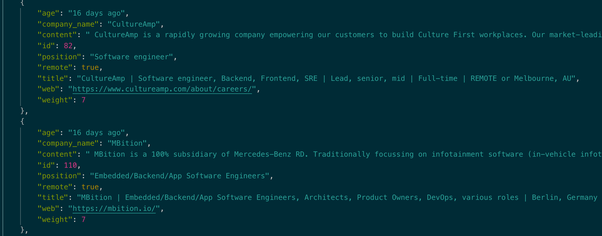

## Basic overview
This project is the first phase of my hackernews crawler.
The main purpose of this project is to extract the data that is related to me, from the monthly hackernews hiring posts, and convert it into more user friendly interface.  

&nbsp;&nbsp;&nbsp;&nbsp;&nbsp;&nbsp;&nbsp;&nbsp;&nbsp;&nbsp;&nbsp;&nbsp;&nbsp;&nbsp;&nbsp;&nbsp;&nbsp;&nbsp;&nbsp;


[](https://opensource.org/licenses/MIT)

## Installation

```bash
git clone this-project
```

```python
pip3 install scrapy
```

## Usage
#### Running the crawler
```python
scrapy runspider crawler.py -o ../data/output.json
```
#### Running the cleaning script
```python
python3 main.py
```

#### Result



## Contributing

1. Fork it
2. Create your feature branch (`git checkout -b my-new-feature`)
3. Commit your changes (`git commit -am 'Add some feature'`)
4. Push to the branch (`git push origin my-new-feature`)
5. Create new Pull Request